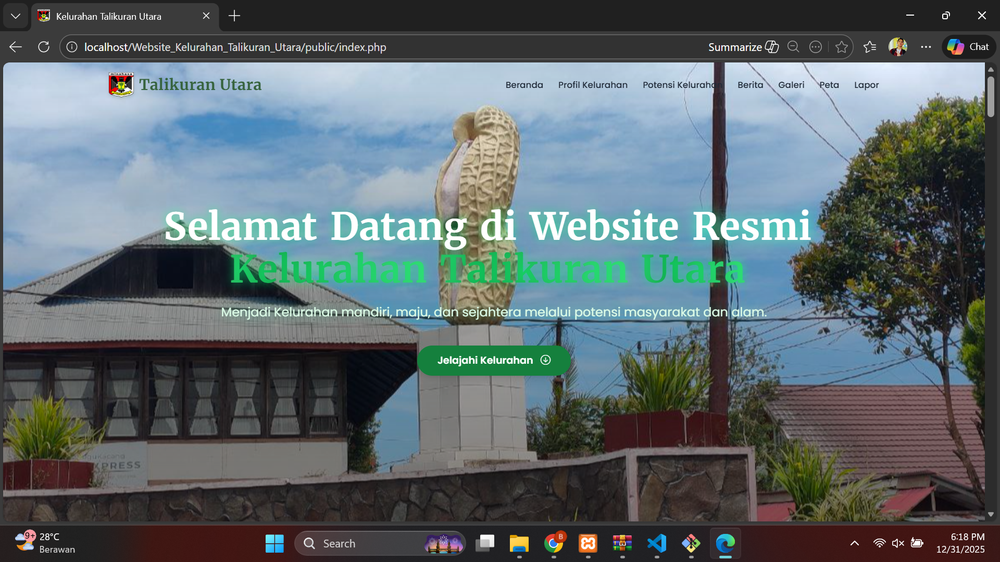
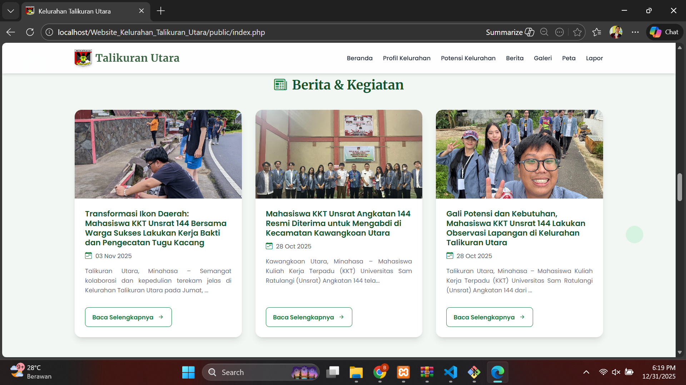
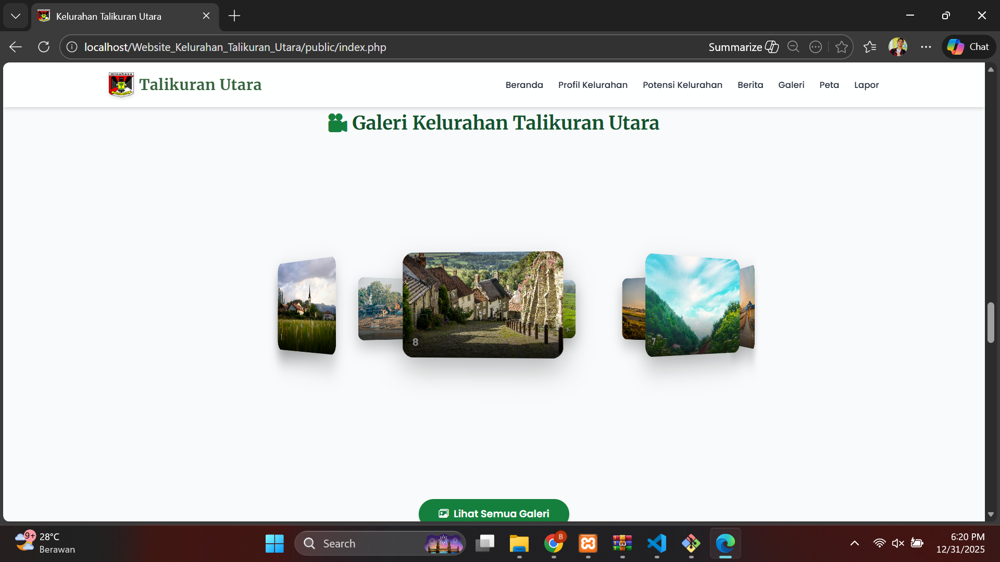
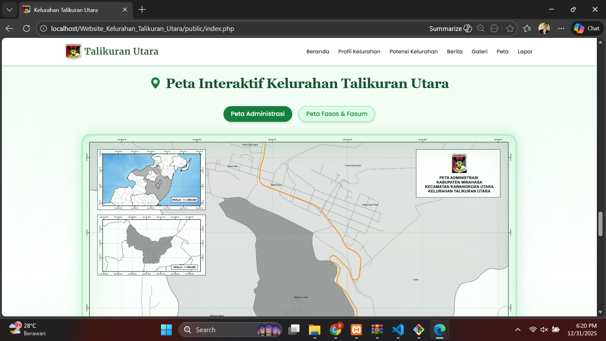
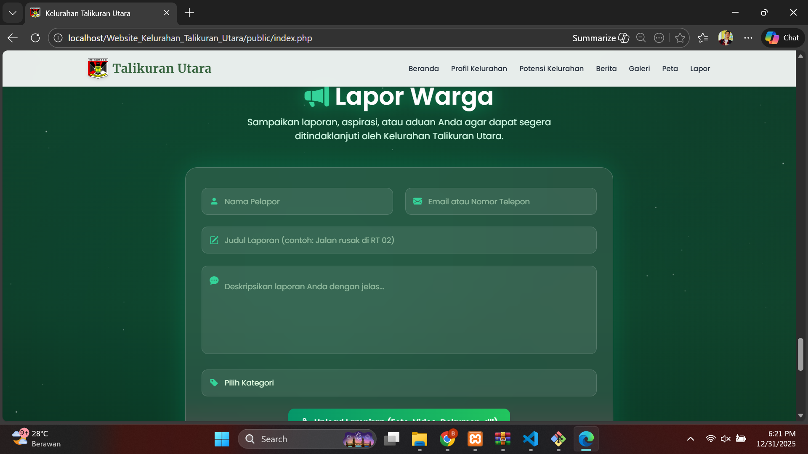
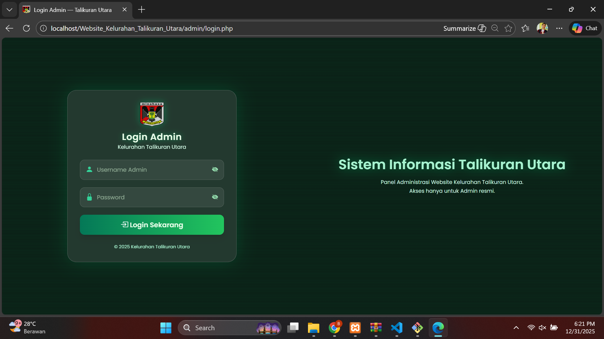
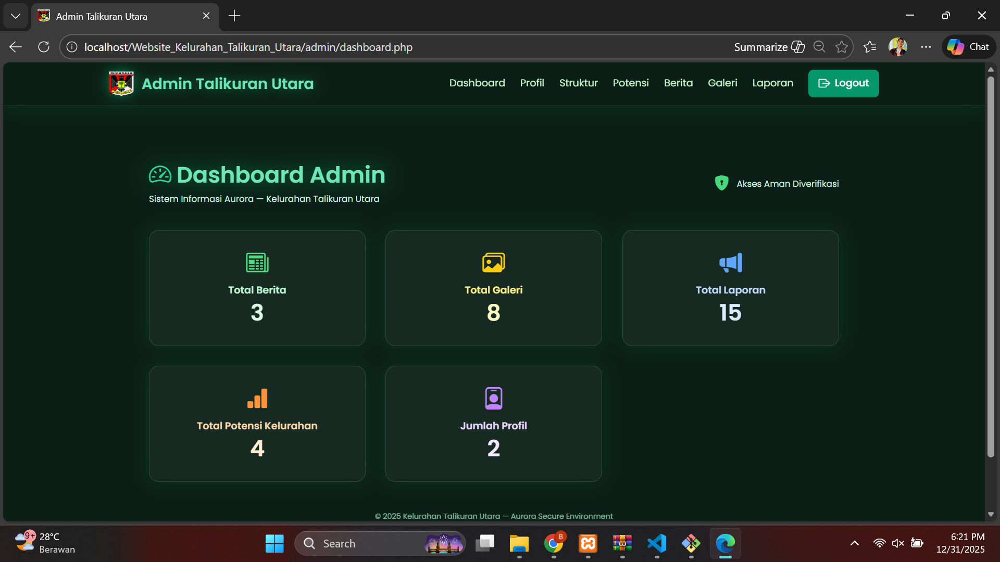
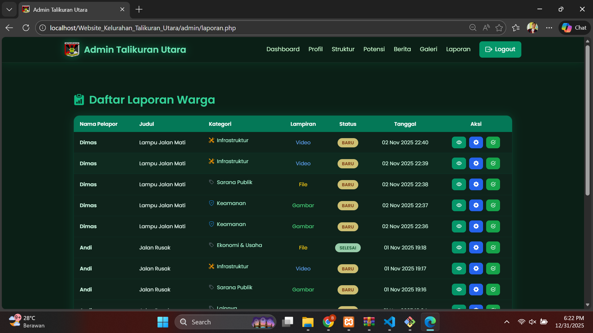

# 🏛️ Website Kelurahan Talikuran Utara — Sistem Informasi Kelurahan

Website ini merupakan proyek pengembangan **Sistem Informasi Kelurahan Talikuran Utara** sebagai salah satu program utama **Kuliah Kerja Terpadu (KKT) UNSRAT Angkatan 144** — Posko Kelurahan Talikuran Utara.

Website ini dirancang untuk:
- menyajikan informasi profil & potensi kelurahan,
- menampilkan berita & galeri kegiatan,
- menyediakan fitur **Lapor Warga**,
- serta dilengkapi **Dashboard Admin** untuk pengelolaan konten digital kelurahan.

---

## 🌐 Fitur Utama Website

### 🏠 Halaman Utama — Portal Informasi Kelurahan
- Header banner hero section
- Motto & visi pengembangan wilayah
- Navigasi cepat ke seluruh fitur



---

### 📰 Berita & Kegiatan Kelurahan
- Publikasi kegiatan warga & pemerintah
- Dokumentasi kegiatan KKT UNSRAT
- Informasi sosial, budaya, dan lingkungan



---

### 🖼️ Galeri Kelurahan
- Album foto kegiatan & dokumentasi wilayah
- Tampilan carousel gallery interaktif



---

### 🗺️ Peta Interaktif Kelurahan
- Peta Administrasi Wilayah
- Peta Fasos & Fasum
- Mendukung visualisasi spasial lingkungan



---

### 📢 Fitur Lapor Warga
Masyarakat dapat menyampaikan:
- laporan infrastruktur,
- kebersihan,
- keamanan & sosial,
- serta aspirasi umum.

Setiap laporan disertai:
- kategori laporan
- deskripsi aduan
- file lampiran (gambar / video / dokumen)



---

## 🛠️ Panel Admin — Manajemen Konten Kelurahan

### 🔐 Login Admin
Akses dikhususkan bagi petugas resmi kelurahan.



---

### 📊 Dashboard Admin
Menampilkan statistik utama:
- total berita
- total galeri
- total laporan warga
- total profil & potensi kelurahan



---

### 🗂️ Manajemen Data Laporan
Admin dapat:
- melihat detail laporan
- memverifikasi laporan
- mengubah status laporan
- mengelola arsip data



---

## 🏗️ Teknologi yang Digunakan

- PHP Native
- MySQL / phpMyAdmin
- HTML5, CSS3, JavaScript
- Bootstrap UI + Custom Styling
- Google Maps / Static Mapping Asset

> Sistem dikembangkan & diuji secara lokal menggunakan XAMPP.

---

## ⚙️ Cara Menjalankan Proyek (Localhost)

1. Clone / ekstrak project ke folder:
```
htdocs/Website_Kelurahan_Talikuran_Utara
```

2. Import database:
```
sql/talikuran_utara.sql
```

3. Jalankan Apache & MySQL di XAMPP

4. Akses melalui browser:
```
http://localhost/Website_Kelurahan_Talikuran_Utara/public/index.php
```

Panel Admin:
```
http://localhost/Website_Kelurahan_Talikuran_Utara/admin/login.php
```

---

## 👥 Anggota Posko KKT — Kelurahan Talikuran Utara

KKT UNSRAT Angkatan 144 — **Posko Kelurahan Talikuran Utara**

- ANGEL C. DIAMANTI  
- AGUNG T. A. SULU  
- BELENCIA KEMBUAN  
- BRANDO M. ZUSRIADI  
- BRIAN WATUNG  
- EKLESIA A. C. MANDOLANG  
- MATTHEW V. SOROMI  
- MOHAMMAD T. BANTENG  
- NAFTALIA SAMBUR  
- VICTORIA A. KUMAYAS  
- YUSEPHINE BATEBANDERA  


---

## ✨ Tujuan Pengembangan

Proyek website ini bertujuan untuk:

✔ digitalisasi informasi kelurahan  
✔ mempermudah penyebaran berita & dokumentasi kegiatan  
✔ memfasilitasi laporan masyarakat secara modern  
✔ membantu pemerintah kelurahan dalam pengelolaan data  
✔ menjadi legacy & kontribusi nyata KKT UNSRAT 144

---

## 📌 Catatan Tambahan

Jika struktur folder repo berbeda dengan dokumentasi di atas,
silakan menyesuaikan path file sesuai direktori proyek Anda.

---

## 🚀 Status Pengembangan

Project ini telah:
- selesai dikembangkan
- diuji pada lingkungan lokal
- siap dikembangkan ke tahap _deployment_ server hosting

Pengembangan lanjutan dapat mencakup:
- sistem autentikasi multi-admin
- integrasi notifikasi laporan
- integrasi API peta dinamis

---

## 📝 Lisensi

Proyek ini dikembangkan untuk kepentingan edukasi & pengabdian masyarakat
dalam program **KKT Universitas Sam Ratulangi**.

Hak cipta konten & data internal berada pada:
> Pemerintah Kelurahan Talikuran Utara.

---

Terima kasih 🙌  
Jika ingin saya sesuaikan format README agar sesuai struktur repo GitHub-mu,
tinggalkan pesan saja — saya akan revisikan.